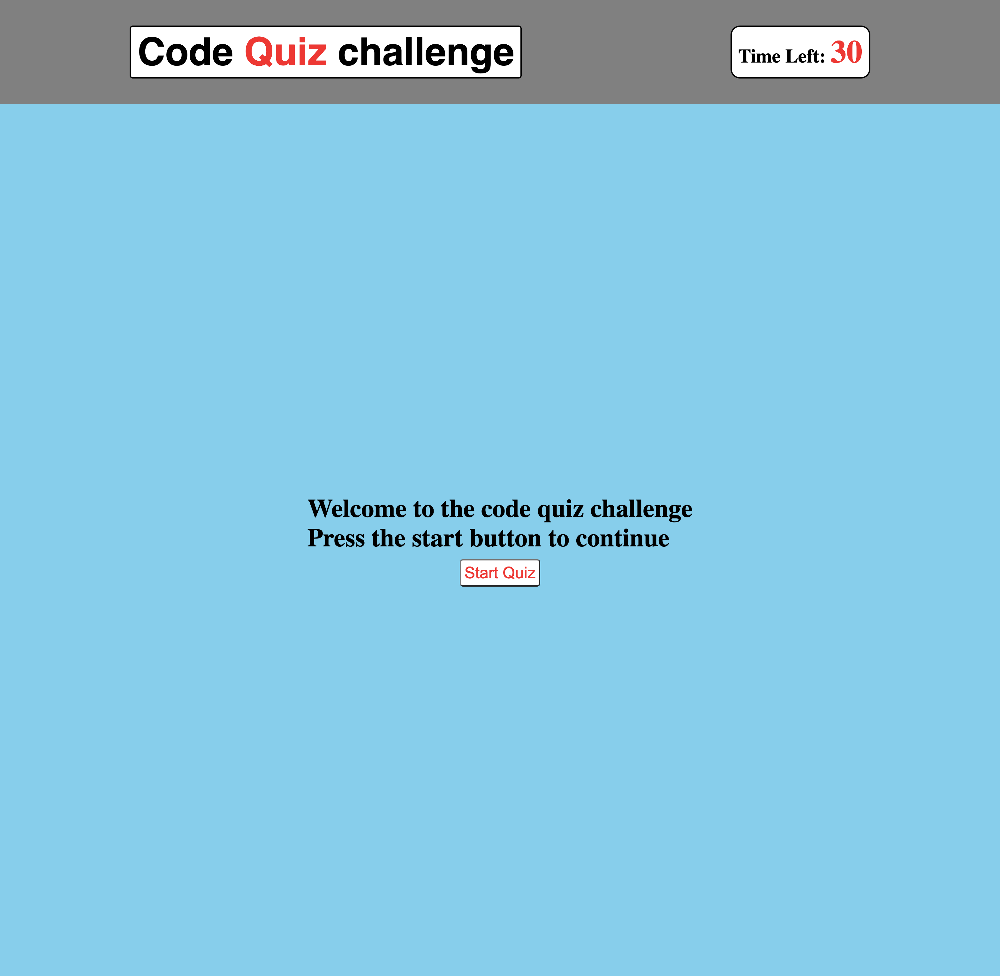

# Code-Quiz-Challenge

This is a project I am tasked to built a timed quiz application that records and store data in the local storage to enable it to be retrive when the page loads.

# Screenshot of the project

# Languanges use to design this application

- HTML
- CSS
- JavaScript (Web API)

# links

- The link to deploy the application: https://bongomin256.github.io/Code-Quiz-Challenge/index.html
